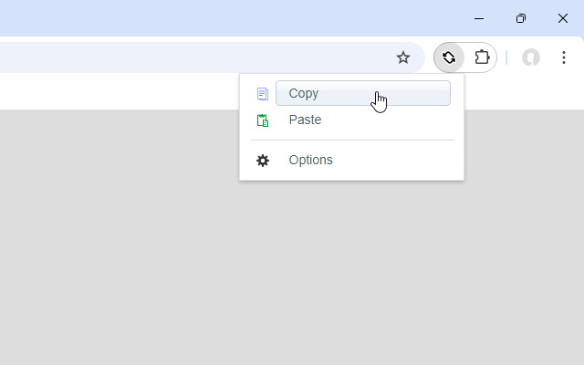

# Copy URL of All Tabs

<!-- badge -->

## About

You can copy the URLs of all open tabs to the clipboard or open all URLs in the clipboard at once.

## Features

- Copy
	- Copy the URLs of all open tabs to the clipboard in any format (text, json, custom).
- Paste
	- Open all URLs in the clipboard at once. The URLs to be opened can be filtered.

## System Requirements

- Google Chrome or Chromium-based browsers (version 125 or later).
- Mozilla Firefox or Firefox-based browsers (version 125 or later).

## Installation

Install it from your browser's official extension store:
- [Chrome Web Store](https://chromewebstore.google.com/detail/copy-url-of-all-tabs/glhbfaabeopieaeoojdlaboihfbdjhbm)
- [Mozilla Add-ons](https://addons.mozilla.org/firefox/addon/copy-url-of-all-tabs/)

## How to use

1. Click on the icon of "**Copy URL of All Tabs**" on the right side of the address bar.
2. Action
	- To "Copy all tab URLs"
		- Click **Copy** in the Popup Menu. The URLs of all open tabs are copied to the clipboard.
	- To "Open the URL in the clipboard in a new tab"
		- Click **Paste** in the Popup Menu. The URLs in the clipboard are opened at once.
	- To "Open the Settings"
		- Click **Options** in the Popup Menu.
		- Alternatively, right-click on the "Copy URL of All Tabs" extension icon displayed to the right of the address bar and select **Options** from the menu.

For more detailed instructions, please refer to one of the following:
- [User Guide](./docs/UserGuide/README.md)
- [User Guide (Japanese version)](./docs/UserGuide/README.ja.md)

## Support

Please note that as this is a free extension we are unable to provide personalized support.

If you have issue or feature requests, please report them at issues (https://github.com/from-es/copy-url-of-all-tabs/issues).

## FAQ or Known Issues

### Tab position setting is ignored when pasting URLs in Vivaldi Browser

Vivaldi prioritizes browser-side settings (**Settings >> Tabs >> New Tab Position**) over extension settings.

### Links to pages opened with "Copy URL to all tabs" do not marked as "Visited"

If opened links are not marked as “visited”, then that is a **Google Chrome** specification; the behavior specification changed in an update in **early 2025/03**. For more information on this change, see the following article.

Partitioning :visited links history - Chrome Platform Status  
https://chromestatus.com/feature/5101991698628608

Countermeasures include,

- Switch to a browser that is not affected by this change
- Change Google Chrome settings to revert to the previous behavior

On Reddit, there were instructions on how to change browser settings to address this issue. If you refer to this, please be aware that there are security risks and do so at your own risk.

#### for Google Chrome or Chromium-based browsers

Reddit links stay blue when using Imagus or opening them manually  
https://www.reddit.com/r/imagus/comments/1j0v8k2/reddit_links_stay_blue_when_using_imagus_or/

#### for Microsoft Edge

Fix for visited links not turning purple on Edge  
https://www.reddit.com/r/Enhancement/comments/1kecupw/fix_for_visited_links_not_turning_purple_on_edge/

## Development

### Build & Installation

For detailed instructions on setting up the development environment, building the extension, and loading it into your browser, please refer to the [Build and Installation Guide](./docs/DeveloperGuide/build-and-install.md).

### Development Guidelines and Tools

To ensure code quality, maintainability, and collaborative development, we use the following tools and guidelines:

- **ESLint**: For consistent coding style and quality.
  - See the [Coding Style Guide](./docs/DeveloperGuide/eslint.md).
- **Vitest**: For efficient unit and integration testing.
  - See the [Test Writing Guide](./docs/DeveloperGuide/vitest.md).
- **commitlint**: For standardized commit messages.
  - See the [Commit Message Guidelines](./docs/DeveloperGuide/commitlint.md).

## Related Links

### Browser Extension Store

- [Copy URL of All Tabs - Chrome Web Store](https://chromewebstore.google.com/detail/copy-url-of-all-tabs/glhbfaabeopieaeoojdlaboihfbdjhbm "Copy URL of All Tabs - Chrome Web Store")
- [Copy URL of All Tabs - Mozilla Add-ons](https://addons.mozilla.org/firefox/addon/copy-url-of-all-tabs/)

### Source Code

- [from-es/copy-url-of-all-tabs - Github](https://github.com/from-es/copy-url-of-all-tabs "https://github.com/from-es/copy-url-of-all-tabs")

## License

This project is licensed under the MIT license. Please read the [LICENSE file](./LICENSE.md "LICENSE file") for more information.

This project also uses third-party libraries, each licensed under its own terms.
For details, please refer to the [Third-Party Notices](./THIRD_PARTY_NOTICES.md "Third-Party Notices") file.