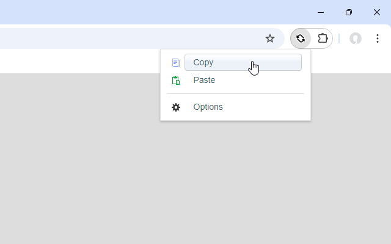

# Copy URL of All Tabs



<!-- badge -->
[](https://deepwiki.com/from-es/copy-url-of-all-tabs)

## About

You can copy the URLs of all open tabs to the clipboard or open all URLs in the clipboard at once.

## Features

- Copy
	- Copy the URLs of all open tabs to the clipboard in any format (text, json, custom).
- Paste
	- Open all URLs in the clipboard at once. The URLs to be opened can be filtered.

## System Requirements

- Google Chrome or Chromium-based browsers.
- Chromium version 125 or later.

## Installation

Install it by visiting the [Copy URL of All Tabs - Chrome Web Store](https://chromewebstore.google.com/detail/copy-url-of-all-tabs/glhbfaabeopieaeoojdlaboihfbdjhbm "Copy URL of All Tabs - Chrome Web Store").

## How to use

1. Click on the icon of "**Copy URL of All Tabs**" on the right side of the address bar.
2. Action
	- To "Copy all tab URLs"
		- Click **Copy** in the Popup Menu. The URLs of all open tabs are copied to the clipboard.
	- To "Open the URL in the clipboard in a new tab"
		- Click **Paste** in the Popup Menu. The URLs in the clipboard are opened at once.
	- To "Open the Settings"
		- Click **Options** in the Popup Menu.
		- Alternatively, right-click on the "Copy URL of All Tabs" extension icon displayed to the right of the address bar and select **Options** from the menu.

## Support

Please note that as this is a free extension we are unable to provide personalized support.

If you have issue or feature requests, please report them at issues (https://github.com/from-es/copy-url-of-all-tabs/issues).

## FAQ or Known Issues

### Tab position setting is ignored when pasting URLs in Vivaldi Browser

Vivaldi prioritizes browser-side settings (**Settings >> Tabs >> New Tab Position**) over extension settings.

### Links to pages opened with "Copy URL to all tabs" do not marked as "Visited"

If opened links are not marked as “visited”, then that is a Google Chrome specification; the behavior specification changed in an update in early 2025/03. For more information on this change, see the following article.

Partitioning :visited links history - Chrome Platform Status  
https://chromestatus.com/feature/5101991698628608

Countermeasures include,

- Switch to a browser that is not affected by this change
- Change Google Chrome settings to revert to the previous behavior

On Reddit, there were instructions on how to change browser settings to address this issue. If you refer to this, please be aware that there are security risks and do so at your own risk.

#### for Google Chrome or Chromium-based browsers

Reddit links stay blue when using Imagus or opening them manually  
https://www.reddit.com/r/imagus/comments/1j0v8k2/reddit_links_stay_blue_when_using_imagus_or/

#### for Microsoft Edge

Fix for visited links not turning purple on Edge  
https://www.reddit.com/r/Enhancement/comments/1kecupw/fix_for_visited_links_not_turning_purple_on_edge/

## Development

### Build

Assuming that [Node.js](https://nodejs.org/ "https://nodejs.org/") is installed.

1. clone this repository locally or download the file.
2. place the file in any local directory.
3. move it to the directory where **package.json** is located.
3. run ```npm install``` to install dependencies.
4. build the extension.
	- **Development** mode. build in the **.output/chrome-mv3-dev** directory.
		- ```npm run dev```
	- **Production** mode. build in the **.output/chrome-mv3** directory.
		- ```npm run build``` (non **source maps**)
		- ```npm run build:sourcemap``` (with **source maps**)

### Installation (Load an unpacked extension)

To install the extensions generated by the build, follow the steps below. Note, built extensions are not automatically updated.

1. enter ```chrome://extensions``` in a new tab or open the **Manage Extensions** page from the toolbar.
2. enable **Developer Mode** by clicking the toggle switch next to Developer mode.
3. click the **Load unpacked** button, select the extension directory you have built.
4. the extension has been installed.


## Related Link

- [Copy URL of All Tabs - Chrome Web Store](https://chromewebstore.google.com/detail/copy-url-of-all-tabs/glhbfaabeopieaeoojdlaboihfbdjhbm "Copy URL of All Tabs - Chrome Web Store")
- [from-es/copy-url-of-all-tabs - Github](https://github.com/from-es/copy-url-of-all-tabs "https://github.com/from-es/copy-url-of-all-tabs")


## License

This project is licensed under the MIT license. Please read the [LICENSE file](./LICENSE.md "LICENSE file") for more information.